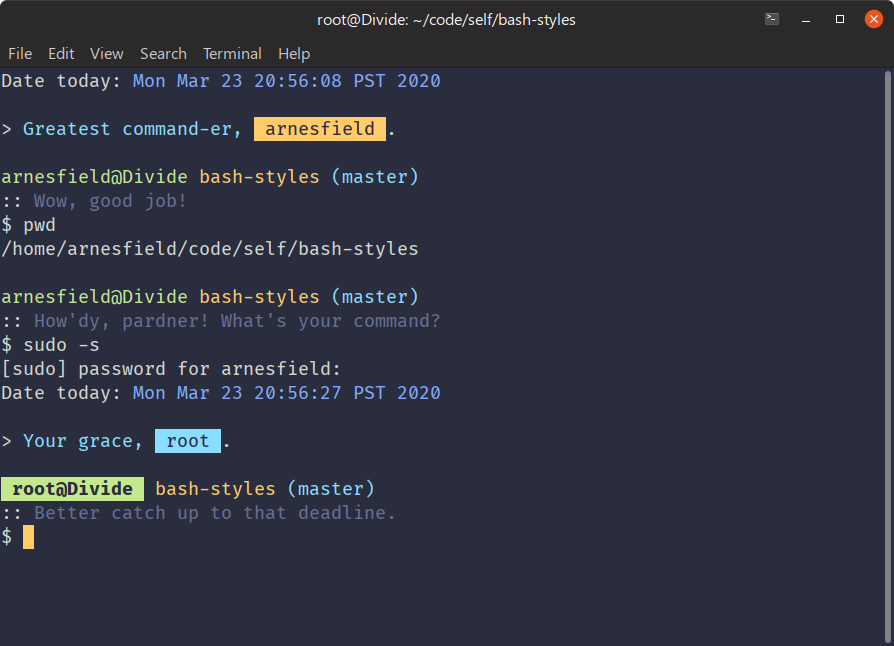

# bash-styles

Personal simple styling for the terminal.

<p align="center">
  
</p>

## Installation

1. Run `install.sh` like so:

   ```sh
   $ sh install.sh
   ```

   This will copy files from `src/` directory to `~/.bash_styles`.

2. Source it in your `.bashrc` or `.bash_profile`:

   ```sh
   source ~/.bash_styles/index.sh
   source ~/.bash_styles/functions.sh
   source ~/.bash_styles/alias.sh
   ```

   Remember to strategically place these!

3. Have fun!

## Uninstall

Run your favorite `rm -rf`!

```sh
# be careful!
$ rm -rf ~/.bash_styles
```
