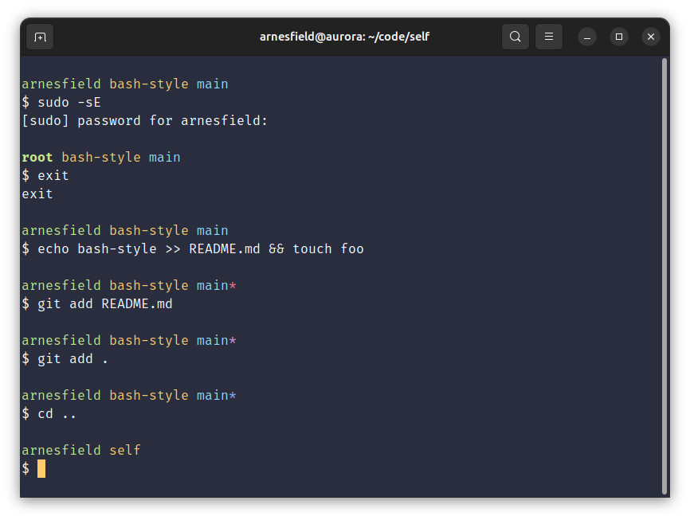

# bash-styles

Personal simple styling for the terminal.

```
<user>@<host> <directory basename> <git branch>
$ <your command>
```



## Installation

1. Download `.bash_styles` to your home directory:

   ```sh
   wget github.com/Arnesfield/bash-styles/raw/master/.bash_styles
   ```

2. Add `.bash_styles` to your `.bashrc` or `.bash_profile`:

   ```sh
   if [ -f ~/.bash_styles ]; then
     . ~/.bash_styles
   fi
   ```

   Note that `.bash_styles` only changes the value of the `PS1` environment variable. Keep this in mind when updating your `.bashrc` or `.bash_profile`.

## Uninstall

1. Remove `.bash_styles` from your `.bashrc` or `.bash_profile`:

   ```sh
   # remove this:
   if [ -f ~/.bash_styles ]; then
     . ~/.bash_styles
   fi
   ```

2. Remove `.bash_styles`:

   ```sh
   rm ~/.bash_styles
   ```
